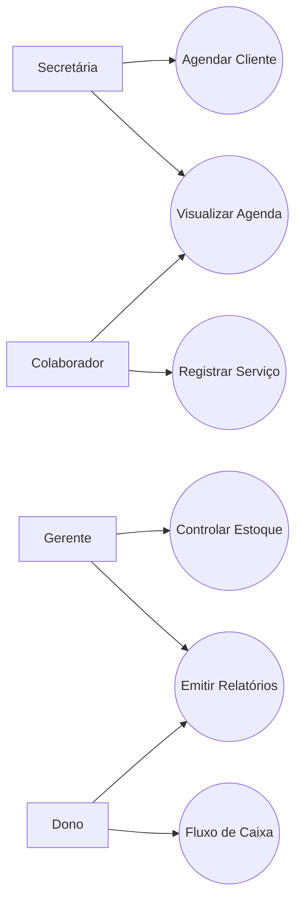
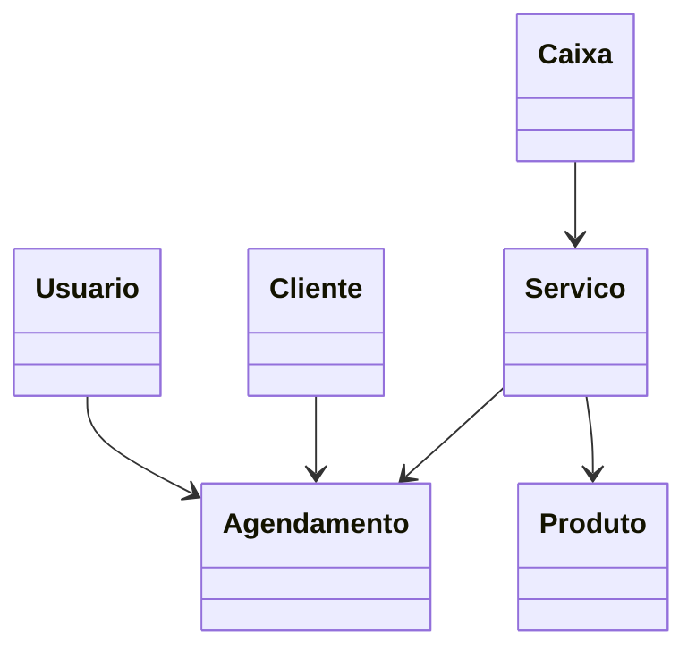
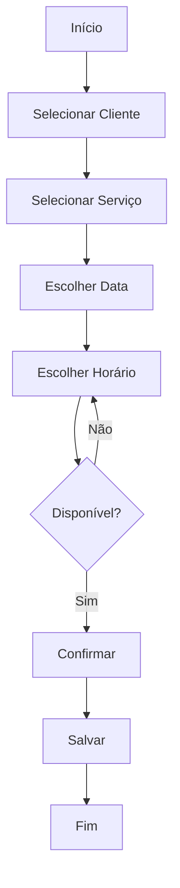

# BeautyFlow UML

## Casos de Uso

```mermaid
flowchart LR
A[Secretária] --> U1((Agendar Cliente))
A --> U2((Visualizar Agenda))
B[Colaborador] --> U2
B --> U3((Registrar Serviço))
C[Gerente] --> U4((Controlar Estoque))
C --> U5((Emitir Relatórios))
D[Dono] --> U6((Fluxo de Caixa))
D --> U5
```

## Classes

```mermaid
classDiagram
class Usuario
class Cliente
class Servico
class Agendamento
class Produto
class Caixa
Usuario --> Agendamento
Cliente --> Agendamento
Servico --> Agendamento
Servico --> Produto
Caixa --> Servico
```

## Atividades

```mermaid
flowchart TD
A[Início] --> B[Selecionar Cliente]
B --> C[Selecionar Serviço]
C --> D[Escolher Data]
D --> E[Escolher Horário]
E --> F{Disponível?}
F -- Sim --> G[Confirmar]
F -- Não --> E
G --> H[Salvar]
H --> I[Fim]
```
